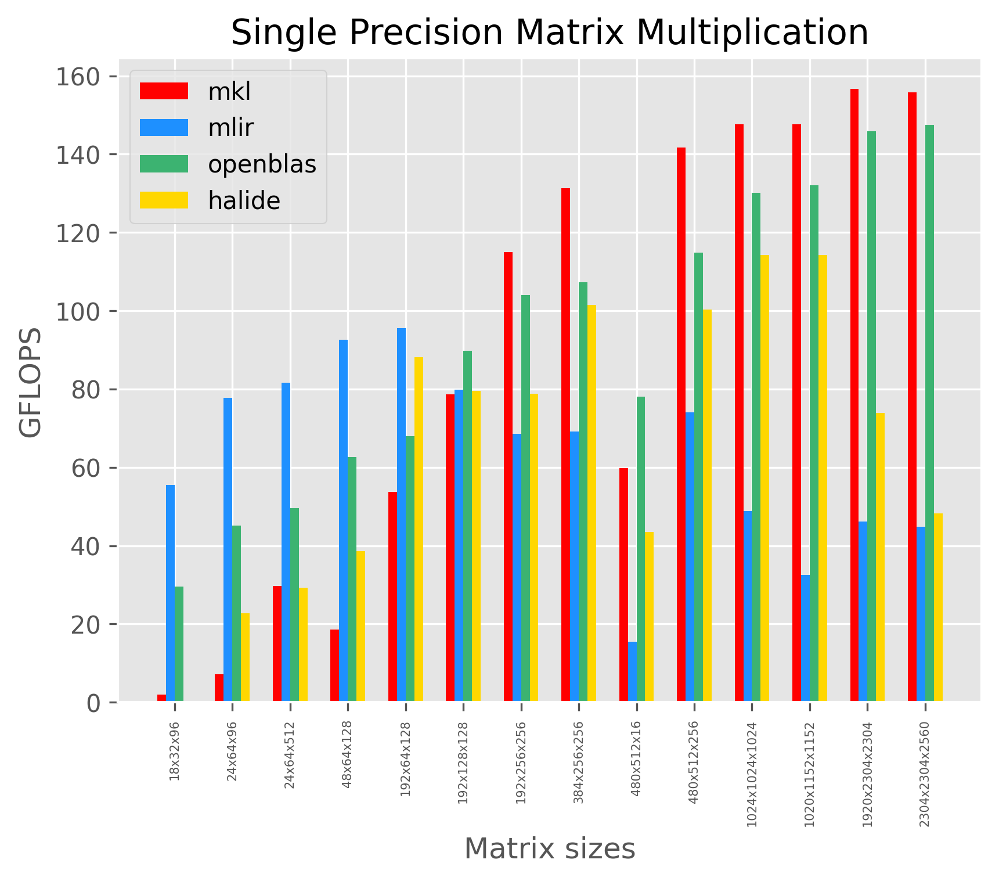

# Matrix Multiplication in MLIR

This repository aims to recreate the results shown in these [slides](https://drive.google.com/file/d/1_zPPxOILAIHOWoSM7GALwioYOGEgD2Xe/view). The current results are shown below.



### Installation
To build the code, run

```
cmake -GNinja -DCMAKE_CXX_COMPILER=clang++-11 -DCMAKE_C_COMPILER=clang-11 -B build .
cmake --build build
```

This code has been tested with clang-11 but older versions will also work.
To plot the results, you will need to install matplotlib.

```
pip install matplotlib
```

### Running the code

We use AOT compilation to generate the binaries for matrix multiplication
and then run them to generate the benchmarking numbers. To run all the tests, do

```
cmake --build build/matmul --target run_all_tests
```

To plot the results against MKL (and generate a plot like above), run

```
python3 plot_results.py
```

To run a specific matrix size (say 24x64x512), run

```
./build/matmul/matmul_24x64x512
```

### Code structure

The linalg codegen pass is in matmul/matmul-compile/matmul-compile.cpp.

### Hardware information

This benchmark was run on an Intel Xeon CPU running at 3.1GHz. The machine has 256Kb L1 cache, 8Mb L2 cache and 24.8Mb L3 cache.
It supports AVX-512 instructions. The peak performance of the machine is 3.1 x 8 x 2 x 2 = 99.2 GFLOPS for double precision
and 198.4 GFLOPS for single precision.
